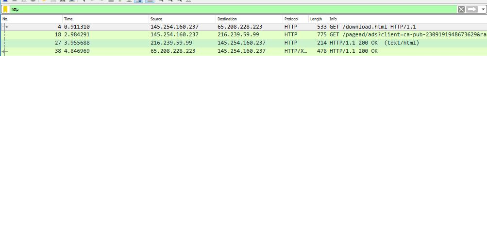
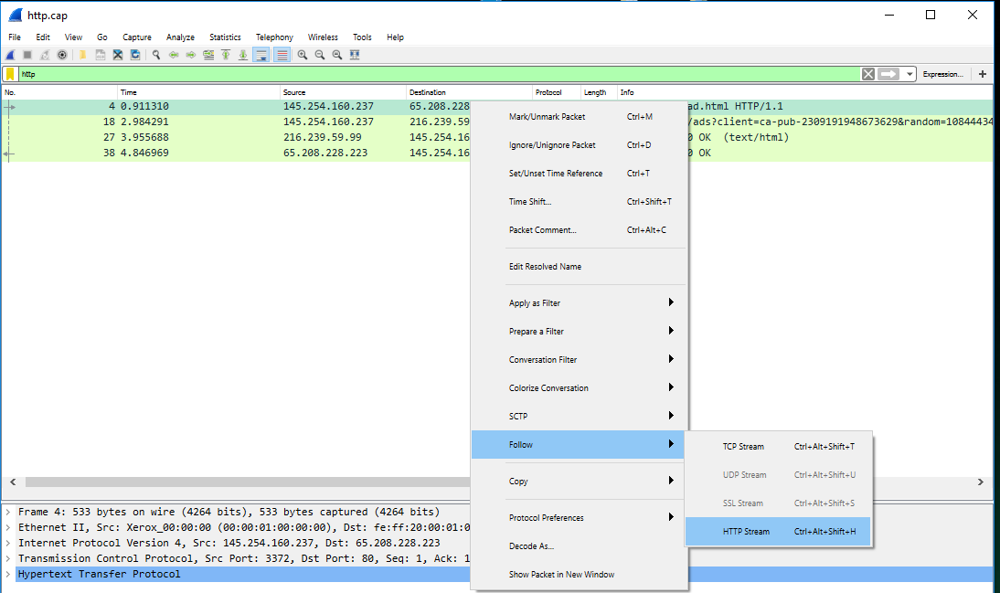
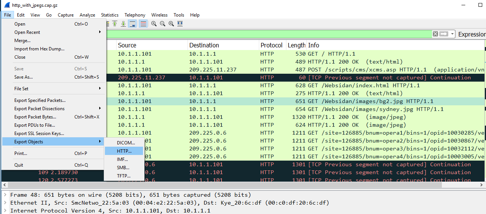
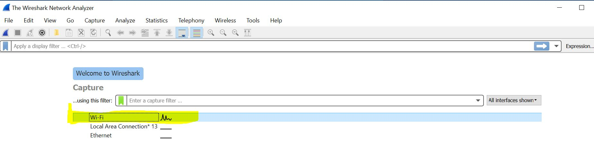
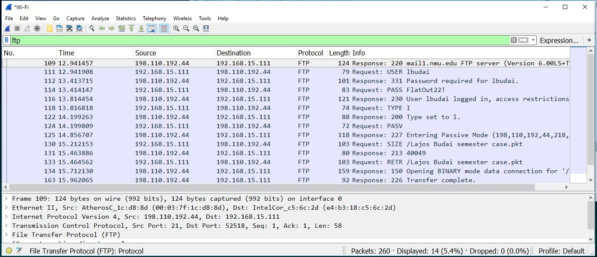

= Fun with Wireshark

Author: Lajos Budai

== Intro

This tutorial will give a basic idea on WireShark. It will introduce how to setup filters and how to capture unencrypted traffic and why is it way better to use encrypted websites.

== Learning objectives
* Capture network traffic in our machine
* Analyze the most common used unsecured traffic
* Setting up some basic filters on Wireshark

== Prerequisites

* Windows computer
* Internet connection
* Wireshark
* Connections to nmu network via wifi or lte ( for lesson 3)
* Download these files: 
```
 https://wiki.wireshark.org/SampleCaptures?action=AttachFile&do=get&target=http.cap
 ```
```

 https://wiki.wireshark.org/SampleCaptures?action=AttachFile&do=get&target=http_with_jpegs.cap.gz
 ```


== Instructions

. Lesson one.
Lets visit a website where we can reconstruct the website by following the tcp/http stream.
* Open the http.cap file
* Set up the filter to only show http traffic ( this is optional, it just help us to learn the filter)


* Now clik on the followings



Now we can see the whole html code, with this information we can reconstruct the whole website.

. Lesson two.
It is very simple to save pictures from an unencrypted website as well.
* Let sopen the http_with_jpegs.cap.gz file
* Open Export Objects, HTTP



* Find an image file and simply save it.

. Lesson three.
Now let's connect to the NMU FTP server
* Go to File Explorer and find [lbudai] on myweb.nmu.edu [this should be your nmuid]
* If it asks your username and password you are all set and you can skip the next bulletpoint
* Create a random txt file, and upload it in here. Now delete the file from your computer, and try to open the file from your nmu server.
* Start capturing the traffic on the interface where we see traffic.


* Now we will have way more traffic, so lets make sure to type ftp to the filter bar.

* The following packets should be in front of us.



Now behind the white-black rectangle my password for nmu is hiding. Anyone who could capture this data, can see my very sensitive password. Using FTP without encryption is a bad practice.


== Challenge
* Lets capture some real traffic. Go and visit some comonly used websites. Can you find any useful information?
* Try to find a website with unencrypted traffic, and try to figure out the context by using wireshark, and try to save down some images.

== Reflection
* What do you think about unencrypted wireless traffic? Can someone capture these kind of traffics from the "air"?


